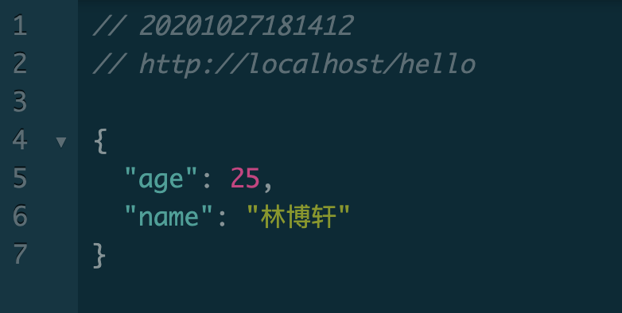

- 模块构成

  - 项目由两个`SpringBoot`的子模块构成，父工程`class-1024-retrofit`
    - `consumer`
      - 服务调用方
      - 端口为：80
      - 引用`retrofit2`调用`provider`模块所暴露的接口
    - `provider`
      - 服务提供方
      - 端口为：8080
      - 暴露 `/hello`接口供`consumer`调用

- 调用方式

  - 调用链接：http://localhost/hello

  - 测试结果：

    

