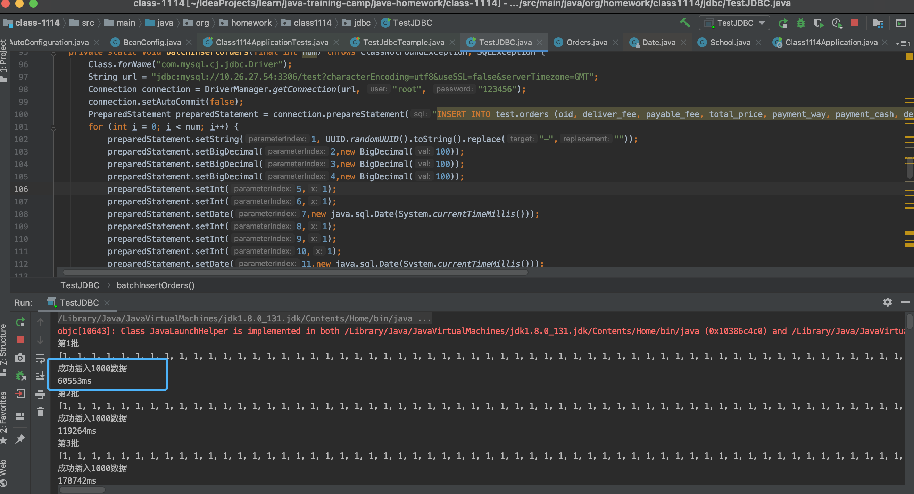
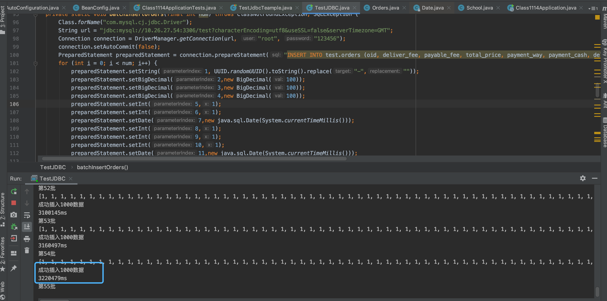
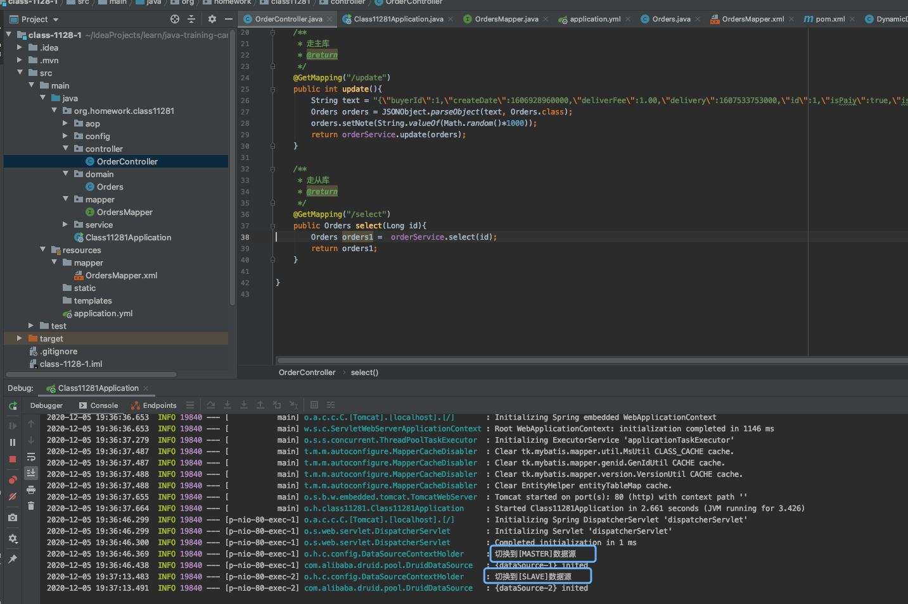
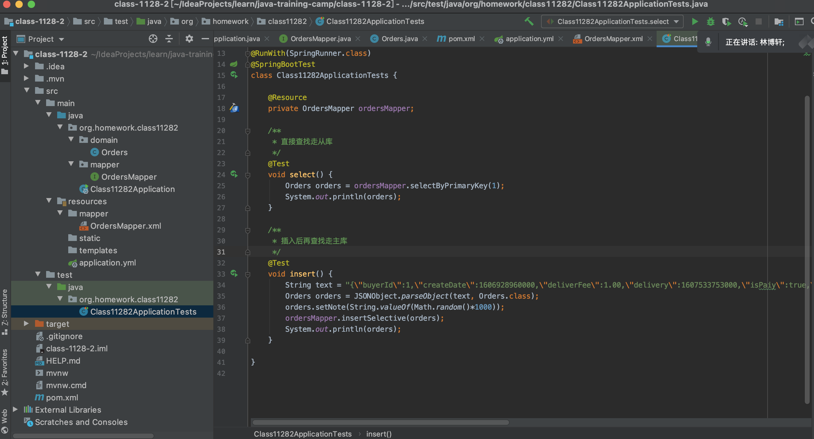

1. 按自己设计的表结构，插入100万订单模拟数据，测试不同方式的插入效率。
   - 使用PreparedStatement.addBatch()，由于链接内网docker上部署的mysql，执行的效率并不是很好

插入1000数据，居然要耗时60s，之后在本机测试再对比小各种插入方式的效率。

   - 
        - 并且插入的执行的时间也越来越久

   - 	

        - 使用sql批量插入，耗时：22 s 996 ms

          ```sql
          -- # 插入数据到订单表中，关闭自动提交，批量插入
          set autocommit=0;
          DROP PROCEDURE IF EXISTS insert_order;
          DELIMITER $
          CREATE PROCEDURE insert_order()
          BEGIN
              DECLARE i INT DEFAULT 1;
              set autocommit=0;
              WHILE i<=1000000 DO
          
          INSERT INTO test.orders (oid, deliver_fee, payable_fee, total_price, payment_way, payment_cash, delivery, isConfirm, is_paiy, state, create_date, note, buyer_id) VALUES ('05053e0f16f9427db2637c8ab4d3b05f', 100.00, 100.00, 100.00, 1, 1, '2020-12-05 00:00:00', 1, 1, 1, '2020-12-05 00:00:00', '122', 1);
                  SET i = i+1;
              END WHILE;
              commit;
          END $
          CALL insert_order();
          ```

     - 使用sql单条循环插入，耗时：22 s 996 ms

       ```sql
       
       
       -- # 插入数据到订单表中，自动提交，一条一条的插入
       set autocommit=1;
       DROP PROCEDURE IF EXISTS insert_order;
       DELIMITER $
       CREATE PROCEDURE insert_order()
       BEGIN
           DECLARE i INT DEFAULT 1;
           WHILE i<=1000000 DO
                   INSERT INTO test.orders (oid, deliver_fee, payable_fee, total_price, payment_way, payment_cash, delivery, isConfirm, is_paiy, state, create_date, note, buyer_id) VALUES ('05053e0f16f9427db2637c8ab4d3b05f', 100.00, 100.00, 100.00, 1, 1, '2020-12-05 00:00:00', 1, 1, 1, '2020-12-05 00:00:00', '122', 1);
               SET i = i+1;
           END WHILE;
       END $
       CALL insert_order();
       
       ```

       

2. 读写分离-动态切换数据源版本1.0

   - class-1128-1

     

3. 读写分离-数据库框架版本2.0

   - class-1128-2

     